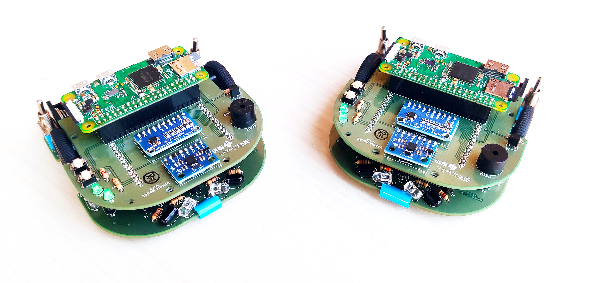

# Welcome to the Doogie Mouse wiki!

 
 

Doogie Mouse platform was originally developed in 2019 as an undergraduate thesis (TheoPrax Methodology) at Centro Universitário SENAI CIMATEC in partnership with Brazillian Institute of Robotics, for teaching principles of artificial intelligence using ROS framework for writing and reusing robot software. It's a open source project and expects modifications and contributions from it's users. 

For a detailed description of the robot, see the [wiki](https://github.com/doogie-mouse/doogie/wiki) page.
